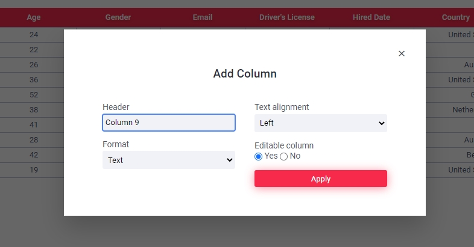
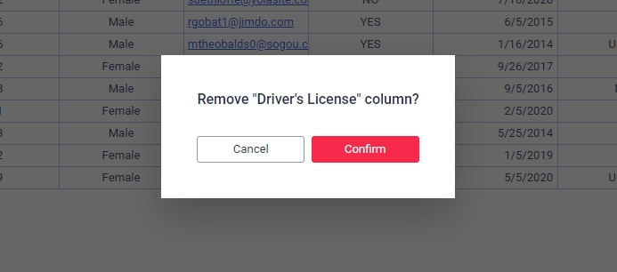

## Overview
This app is a fully dynamic table, that provides the ability to add/modify columns and rows, edit cell values, have typed columns, and several others, and was built using vanilla JS and CSS, no libraries allowed.

When launching the app for the first time, a popup confirmation will appear asking whether to load a blank sheet, which starts off with a single column that has a single row, or to load some mockup fake data. This popup will not showup again unless the object dynamic-table entry is removed from Local Storage.

The table uses a very simple data structure:

```javascript
const SheetModel = {
  id: 'AZCYU-9971-0096',
  title: 'Table Title',
  creationDate: new Date(),
  lastModified: null,
  filterBy: { column: null, order: 'ASC' },
  currentPage: 1,
  preferences: {
    paginateRows: true,
    pageRowLimit: 10
  },
  editHistory: [],
  columns: [
    {
      id: 1,
      header: 'Column 1',
      format: 'text',
      textAlign: 'left',
      order: 1,
      editable: true,
      cells: [{ id: 1, value: null }]
    }
  ]
}
```
> The ID is there for future expansions, such as adding enabling multiple table sheets, allowing to distinguish them.

## Functionality and features:
+ Add/modify columns
+ Sort columns DESC/ASC
+ Add/modify rows
+ Rearrangeable columns
+ Typed columns
+ Styled cell values based off column type
+ Editable cells
+ Highlight cells
+ Move and quick edit cells with keyboard
+ Limit total visible rows
+ Dynamic pagination
+ Records/rows count
+ Basic undo/redo system
+ Export records as JSON and CSV format
+ Save table sheet to Local Storage

## Table columns
Columns are typed, and the cell values are styled and shown according to their type when rendered on the page, and store as the corresponding column's format when entering new data. It's a quick and easy parsing process that flows both ways.

Clicking on the Add Column button will open a modal form where you can choose the column's header label, type/format, cell text alignment, and where the column is editable or locked. this same form will come up when modifying an existing column, but this time it will proload the current's column properties to make it easier to manage.

#### Supported formats/types
+ **text**: displayed as plain text
+ **URL**: displayed as underline colored text
+ **email**: displayed as underline colored text
+ **number**: displayed as plain text
+ **money-usd**: displayed as two decimal points number prefixed with the $ sign
+ **money-eur**: displayed as two decimal points number prefixed with the € sign
+ **datetime**: displayed as friendly
+ **boolean**: displayed as YES/NO

#### Actions:
+ Open column options menu on `right click`.
  - Modify Column
  - Sort A-Z
  - Sort Z-A
  - Clear column
  - Remove column
+ Drag & drop on mouse down to enter the dragging state and switch the header's position. Will automatically change the entire column's position un mouse release.
+ Quick sort ASC/DESC a previously sorted column via the quick sort button that will only show up for said column.

## Table cells and rows

All cells display their value based on the column's format, text alignment, editable/lock state, and several other factors. Cells that show the value of URLs and emails will be able to perform certain actions on `Ctrl + Click`. Links will be opened on a new tab, and emails will take the user to their default mail client app.

Clicking on the Add Row button will enter a new row.

#### Actions:
+ `Left click` to select/highlight a cell. 
+ Double click to enter edit mode. The entered value will rendered according to the cells' column format.
+ Key up and down after selecting a cell
  - `Up/down` and `left/right` to navigate through the cells
  - `F2` and `Enter` to enter edit mode.
  - During edit mode, `Enter` to save the new entered value
  - During edit mode, `Esc` to cancel edit mode. Cell retains its original value
  - `Ctrl + Z` and `Ctrl + Y` to undo or redo an action
  - Insta-edit mode upon selecting a cell and immediately entering any keyboard character or pasting in a value using `Ctrl + V`
  - `Del` to instantly delete a cells value 
+ `Shift + Ctrl + Click` on a cell to select the entire row, and remove the row. Will display a popup confirmation 

> Edit mode will display a calendar widget on cell's that have a datetime format.

## Pagination Area
Has a limit of 3 numbered buttons that update automatically on on row insertion or delation.
Next and Previous buttons disabled state is automatically updated to reflect the current page position. 

## Table Column Form
Can be invoked when adding a new column, or modifying an existing one. Contains fields to enter the column header, the text alignment, column format and indicate whether it can be edited.



## Popup Confirmation
Pretty self explanatory. Exists for the purpose of double-checking if the user wishes to proceed with a certain task such as clearing or removing a column or removing a row.



> All modals and be exited on `Esc` key press

